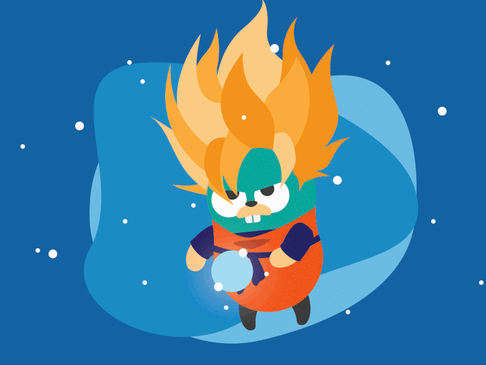

<h1>⚜️ GOLANG COURSE⚜️</h1>
<h2>🔹 English</h2>
<h4>🔹 Basic programs and syntaxes about Golang, referring to the mini course that will be presented in class for the discipline of Programming Language </h4>
<h4>🔹 Enjoy and have fun </h4> 
<h2>🔹 Português</h2>
<h4>🔹 Programas básicos e sintaxes sobre Golang, referentes ao minicurso que será apresentado em aula para a disciplina de Linguagem de Programação  </h4>
<h4>🔹 Aproveite e divirta-se</h4>
 
<h4><b>⚠️ Documentação feita em Portugues/Documentation all in Portuguese Pt / Br⚠️</b></h4>

